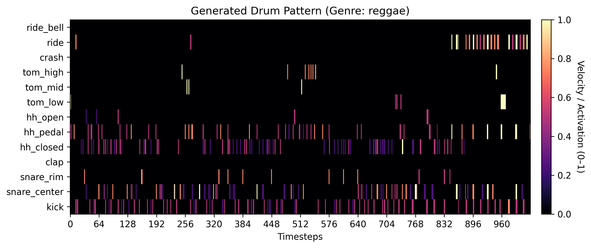
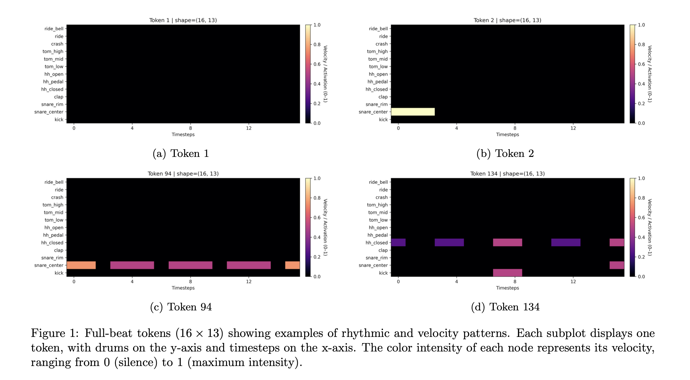
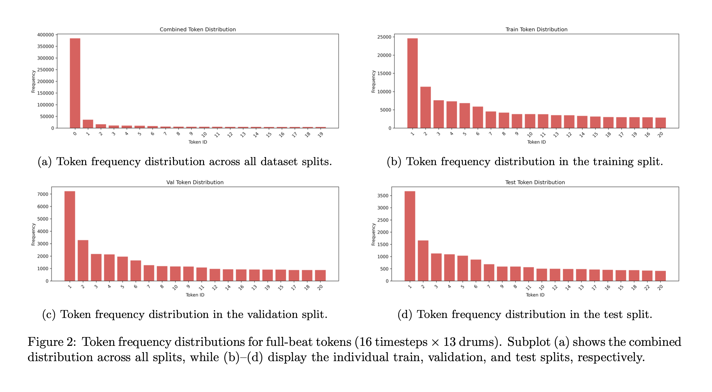
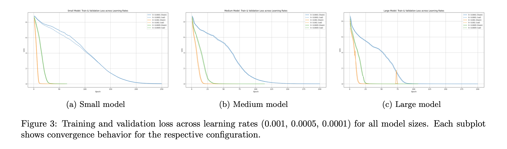
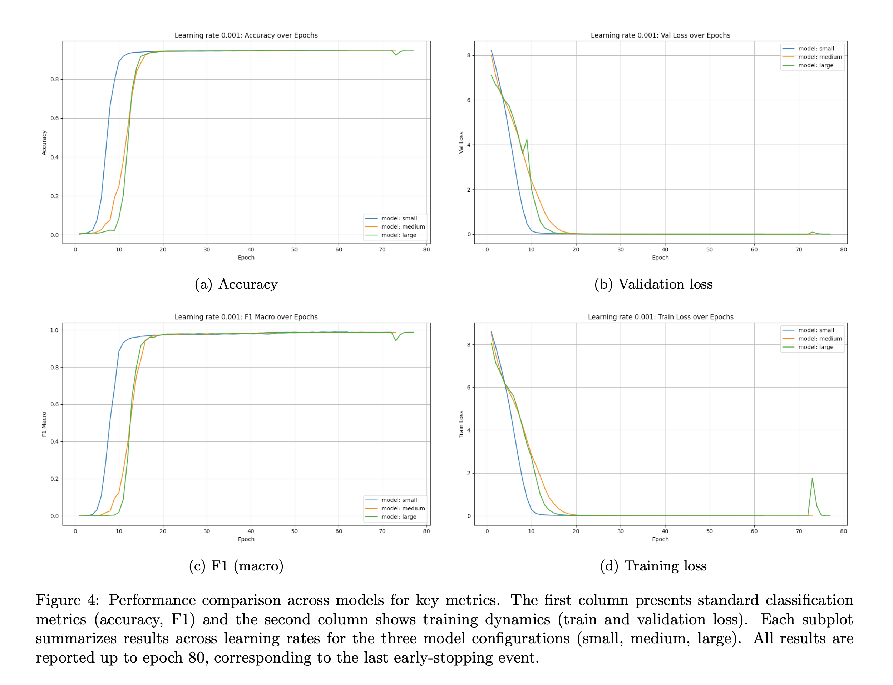

# 🥁 Human-Like Drum Rhythm Generation with LSTMs



This project explores the generation of expressive, human-like drum patterns using a sequence-to-sequence LSTM architecture trained on the [Expanded Groove MIDI Dataset (E-GMD)](https://magenta.tensorflow.org/datasets/e-gmd).

The pipeline is fully configuration-driven via a central YAML config file and includes:

- MIDI preprocessing and tokenization  
- Training of LSTM models with varying capacities  
- Token prediction and MIDI regeneration  
- Evaluation via statistical metrics and visual/audio inspection  

**Listen to generated samples:**
- [Blues](assets/small_blues_temperature_0_8_sample_5684.mp3)
- [Dance](assets/small_dance_temperature_0_8_sample_14187.mp3)
- [Neworleans](assets/small_neworleans_temperatue_0_8_sample_3015.mp3)


## Table of Contents

- [Project Goals](#project-goals)
- [Architecture](#architecture)
  - [Preprocessing](#️preprocessing)
  - [Model](#model)
  - [Training](#training)
  - [Evaluation](#evaluation)
- [Results](#results)
  - [Quantitative Performance](#quantitative-performance)
  - [Generated Samples](#generated-samples)
- [Installation](#installation)

## Project Goals

- Model stylistic timing and velocity nuances of human drummers  
- Compare model sizes (`small`, `medium`, `large`) and learning rates  
- Evaluate generation quality both quantitatively and qualitatively  
- Generate drum patterns for 12 genres:  
  `afrocuban, dance, blues, funk, hiphop, jazz, latin, neworleans, pop, reggae, rock, soul`  

## Architecture

### Preprocessing

1. **MIDI Reading**: Parse MIDI files
2. **Pitch Grouping**: Map MIDI pitches to 13 canonical drum categories  
3. **Drumroll Conversion**: Convert to `(T × 13)` matrix  
4. **Segmentation**: Extract overlapping sequences of `segment_len`  
5. **Tokenization**: Convert each `token_len`-timestep beat into a token  
6. **Pruning**: Keep top 95% most frequent tokens, rest → `[UNK]`  

Example tokens after preprocessing is done:


Data distribution after preprocessing is done:


### Model

**Seq2Seq LSTM Architecture:**

- **Encoder**: Processes input sequence with embeddings for tokens, position (cyclic sin/cos), genre, and BPM
- **Decoder**: Generates output tokens autoregressively with teacher forcing during training
- **Embeddings**: Token (64-256d), Position (4-16d), Genre (8-16d), BPM (4d)
- **LSTM Layers**: 1-3 layers with 128-512 hidden units depending on model size

| Model  | Hidden | Layers | Token Embed | Params |
|--------|--------|--------|-------------|--------|
| Small  | 128    | 1      | 64          | ~500K  |
| Medium | 256    | 2      | 128         | ~2M    |
| Large  | 512    | 3      | 256         | ~8M    |


### Training

- **Loss**: Cross-entropy with class weighting for imbalanced tokens
- **Optimizer**: AdamW with configurable learning rate
- **Teacher Forcing**: Linear decay from 1.0 to -2.0 over training
- **Early Stopping**: Patience of 5 epochs on validation loss
- **Batch Size**: 1024 sequences
- **Epochs**: Up to 500 with early stopping

**All parameters configurable in `config.yaml`**

### Evaluation

**Metrics:**
- Token-level accuracy, precision, recall, F1-score
- Visual inspection of generated patterns
- Audio playback of MIDI outputs


## Results

### Quantitative Performance

Example metrics (Small model, lr=0.001, seg_512):

|Metric | Value|
|-------|------|
|Accuracy | 0.949|
|F1 (macro) | 0.988|
|Precision (macro) | 0.982|
|Recall (macro) | 0.999|

Comparisons of different learningrates per model:


Comparisons of different models with learningrate of 0.001:


### Generated Samples
Example of generated output:


## Installation

```bash
# Clone the repository
git clone https://github.com/Arthurreuss/NN_Drumming_Project.git
cd NN_Drumming_Project

#Set up virtuall environment
python -m venv NAME
source NAME/bin/activate

# Install required Python packages
pip install -r requirements.txt

# Download the E-GMD dataset
# https://magenta.tensorflow.org/datasets/e-gmd#download
# Place it here:
# → dataset/e-gmd-v1.0.0/

# Quick start
python -m main --model small --learning_rate 0.001
```

